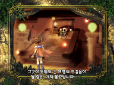
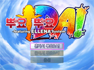
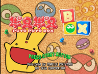
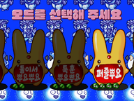
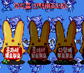
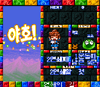
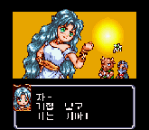

# 뿌요뿌요 시리즈 한글 번역 프로젝트

컴파일사의 대표작 뿌요뿌요(ぷよぷよ) 시리즈의 한글 번역 패치를 배포하는 프로젝트입니다.

Claude Code / Codex를 활용하여 리버싱/번역하고, 사람이 기초 검수를 진행한 프로젝트입니다.

공개된 패처 코드는 [기기별 패처 목록](https://github.com/mcpads/kr-patcher-index)에서 확인할 수 있습니다.

> 자매 프로젝트 - [마도물어 시리즈 한글 번역 프로젝트](https://github.com/mcpads/madou-monogatari-kr-patch)

## 배포 중인 패치

| 대표 이미지 | 게임 | 기종 | 버전 | 상태 | 최근 배포 |
| --- | --- | --- | --- | --- | --- |
|  | [뿌요뿌욘](dc-puyopuyon/) | 드림캐스트 | v1.0.1 | 정식 | 2026-07-10 |
|  | [뿌요뿌요 DA!](dc-puyopuyo-da/) | 드림캐스트 | v1.0.0 | 정식 | 2026-09-11 |
|  | [뿌요뿌요 BOX](ps1-puyopuyo-box/) | PlayStation | v0.1.1 | 베타 | 2026-09-21 |
|  | [뿌요뿌요 2 퍼펙트 셋](ps2-puyopuyo2-perfect-set/) | PlayStation 2 | v0.1.0 | 베타 | 2026-09-15 |
|  | [슈퍼 뿌요뿌요 2](sfc-puyopuyo2/) | SNES | v1.1.0 | 정식 | 2026-08-09 |
|  | [슈퍼 나조 뿌요 1](sfc-nazo-puyo1/) | SNES | v1.0.0 | 정식 | 2026-07-11 |
|  | [슈퍼 나조 뿌요 2](sfc-nazo-puyo2/) | SNES | v1.0.0 | 정식 | 2026-07-15 |

각 작품 페이지에서 패치 파일, 적용 방법, 체크섬과 크레딧을 확인할 수 있습니다.

- [업데이트 기록](CHANGELOG.md)
- [번역 예정 작품](#번역-예정-작품)
- [이슈 제보 및 피드백](#이슈-제보-및-피드백)
- [라이선스](#라이선스)

## 번역 예정 작품

### 뿌요뿌요!! 20주년 기념판 (NDS)

진행 중입니다. 번역 초안을 적용했으며, 그래픽 한글화와 검수를 진행하고 있습니다.

- [x] 일본어 폰트 추출 및 테이블 완성
- [x] 시나리오 텍스트 추출
- [x] 시나리오 및 이벤트 대사 번역 초안
- [x] 한글 폰트 통합 및 적용
- [ ] 시스템 UI
- [ ] 시스템 안정성
- [ ] 플레이 테스트 및 최종 검수

### 뿌요뿌요!! 20주년 기념판 (PSP)

진행 중입니다. 번역 초안을 적용했으며, 그래픽 한글화와 검수를 진행하고 있습니다.

- [x] 일본어 폰트 추출 및 테이블 완성
- [x] 시나리오 텍스트 추출
- [x] 시나리오 및 이벤트 대사 번역 초안
- [x] 한글 폰트 통합 및 적용
- [ ] 시스템 UI
- [ ] 시스템 안정성
- [ ] 플레이 테스트 및 최종 검수

## 이슈 제보 및 피드백

어색한 번역, 번역 오타, 심각한 그래픽 깨짐, 게임 멈춤 등의 문제는 아래 방법으로 제보해 주세요.

- **GitHub Issue**: [이슈 트래커](https://github.com/mcpads/puyo-puyo-kr-patch/issues)에 새 이슈를 등록해 주세요.
- **제보 시 포함할 내용**:
  - 문제가 발생한 위치 (예: 아르르 스토리 3번째 만담)
  - 문제 현상 (예: 대사가 대사창 밖으로 넘침)
  - 가능하다면 스크린샷

## 라이선스

- 본 패치 파일은 개인적, 비상업적 용도로 제공됩니다. 원작 게임의 저작권은 해당 권리자에게 있습니다.
- 본 한글패치 파일 자체를 제작자의 허가 없이 타 사이트에 재배포하지 말아 주시고, 재배포를 원하실 경우 패치 원본 게시물의 링크를 공유해 주시기 바랍니다.
- 본 한글패치 파일을 이용하여 금전적 이득을 취하는 모든 행위를 일절 금합니다. 해당 행위로 발생하는 모든 책임은 이용 당사자에게 있으며, 패치 제작자는 어떠한 책임도 지지 않습니다.
