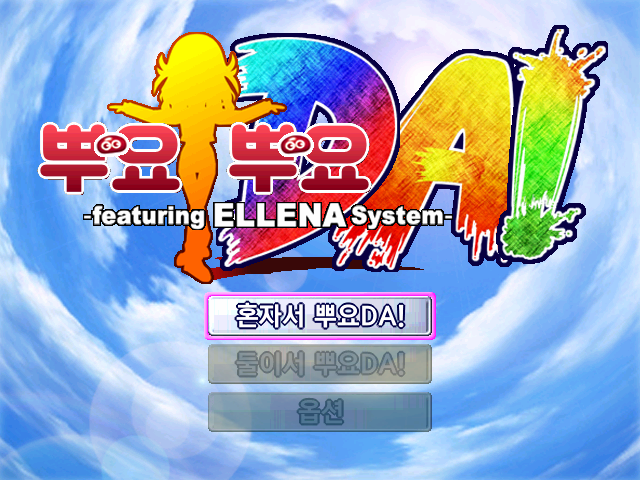
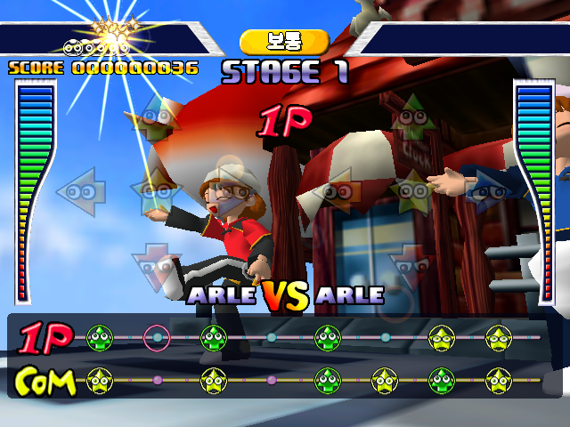

# 뿌요뿌요 DA! (드림캐스트)

[← 패치 목록으로 돌아가기](../README.md)

드림캐스트 **뿌요뿌요 DA! (ぷよぷよDA! -featuring ELLENA System-)** 한글 번역 패치입니다.

## 적용 방법

1. 아래 체크섬과 일치하는 일본판 원본 GDI를 준비합니다.
2. [Puyo Puyo DA! (Dreamcast) KR v1.0.0.dcp](https://raw.githubusercontent.com/mcpads/puyo-puyo-kr-patch/main/dc-puyopuyo-da/Puyo%20Puyo%20DA%21%20%28Dreamcast%29%20KR%20v1.0.0.dcp)를 다운로드합니다.
3. [Universal Dreamcast Patcher](https://github.com/DerekPascarella/UniversalDreamcastPatcher)로 원본 GDI에 DCP 패치를 적용합니다.

## v1.0.0 변경 사항

- 타이틀, 메뉴, 랭킹과 게임 화면 그래픽 한글화
- 수록 작품 소개와 엔딩 그래픽 한글화

## 체크섬

### 배포 패치 v1.0.0

**Puyo Puyo DA! (Dreamcast) KR v1.0.0.dcp**

| 알고리즘 | 해시 |
| --- | --- |
| SHA-256 | `f117463518a6b8ed6907d99cabb487910a234d70bc4342cf999fd908eedd56d5` |
| 크기 | 1,341,928 bytes |

### 원본 GDI (3트랙)

제품 번호 `T6601M`, 버전 `V1.003`입니다.

| 파일 | SHA-256 | 크기 |
| --- | --- | --- |
| `disc.gdi` | `70b7e0c8a0d0b8554a3056c16726b85412d20f3398f2dce6cda5483265d89a3e` | 87 bytes |
| `track01.bin` | `c61e3ee701f17e55a62444c5f22b1d2e47dc5f287d38280015b97703be3ccc77` | 1,914,528 bytes |
| `track02.raw` | `8364bc87848527f027fa6a9d13cae778c0132f3704dff6978173d92df1d71e06` | 1,735,776 bytes |
| `track03.bin` | `ac07913d7179a2d8f1df9f198dc3e6cceb0d78518402f169472453870cc6440b` | 1,185,760,800 bytes |

## 패치 정보

- 게임 내 그래픽 텍스트 한글화

## 크레딧

- **패치 제작자**: mcpads
- **리버싱**: mcpads (with Claude Code, Codex)
- **한글 번역**: Claude Code 및 Codex
- **원작**: Compile / Sega (1999)
