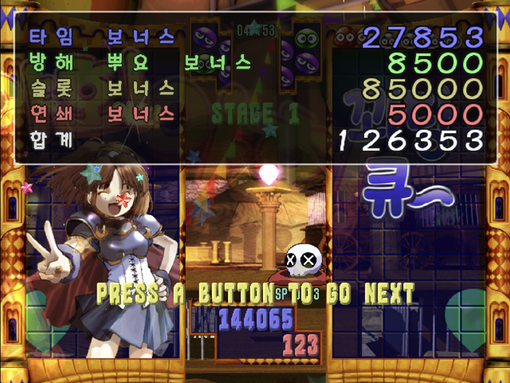

# 뿌요뿌욘 (드림캐스트)

[← 패치 목록으로 돌아가기](../README.md)

드림캐스트 **뿌요뿌욘 (ぷよぷよ~ん, Puyo Puyo 4)** 한글 번역 패치입니다.

참고: [뿌요뿌욘 - 나무위키](https://namu.wiki/w/%EB%BF%8C%EC%9A%94%EB%BF%8C%EC%9A%98)

## 적용 방법

1. **일본판 원본 GDI**를 준비합니다.
2. [Puyo Puyo 4 (Dreamcast) KR v1.0.1.dcp](https://raw.githubusercontent.com/mcpads/puyo-puyo-kr-patch/main/dc-puyopuyon/Puyo%20Puyo%204%20%28Dreamcast%29%20KR%20v1.0.1.dcp)를 다운로드합니다.
3. [Universal Dreamcast Patcher](https://github.com/DerekPascarella/UniversalDreamcastPatcher)로 원본 GDI에 DCP 패치를 적용합니다.

## v1.0.1 변경 사항

- 빈 세이브 첫 부팅 시 저장 파일 생성 중 발생하던 크래시 수정
- OPTION/CONTINUE 문자 스프라이트 테이블을 원본 실행 코드와 겹치지 않는 영역으로 재배치
- GDEMU 비호환 가능성이 있던 오프닝 자막 배경 텍스처 참조 제거
- 오프닝 자막 외곽선 제거

## 체크섬

### 배포 패치 v1.0.1

**Puyo Puyo 4 (Dreamcast) KR v1.0.1.dcp**

| 알고리즘 | 해시 |
| --- | --- |
| SHA-256 | `a90c4c3c995193954194920c01769397c6dde0ebfa01843db662c74ca0fb3ac4` |
| 크기 | 3,773,297 bytes |

### 원본 GDI (27트랙)

데이터 트랙 체크섬:

**track03.bin** (메인 데이터)

| 알고리즘 | 해시 |
| --- | --- |
| MD5 | `a0fadb90f60aae1b5b5cd1d9ceffb018` |
| SHA-1 | `6e5515fcc8e35e0c45083e9de9b9880d6c918420` |
| SHA-256 | `50f6f59f5a53a72e13bda9631d2ed86f31a1ac02907bd3e480e5d99c3fa16af9` |
| 크기 | 278,413,296 bytes |

**track27.bin** (파일 데이터)

| 알고리즘 | 해시 |
| --- | --- |
| MD5 | `95694f7b0957660c165ef8b6b25fd579` |
| SHA-1 | `27ee0d7ac17a917f5b0287c5d70ac7721e215ced` |
| SHA-256 | `fdcece61e384e865bcc1d5ee5af812b021bafb30009ebe35ba87a6b925e767ce` |
| 크기 | 205,661,232 bytes |

**track01.bin** (IP.BIN)

| 알고리즘 | 해시 |
| --- | --- |
| MD5 | `6ef4f836257a40ef0d7480946d6f9bc4` |
| SHA-1 | `40de748625a511e321d05f6f0feee0427a90924f` |
| SHA-256 | `ae8b5cad18af0670d811dffe978d0c608c52f80e46fb8249766abc21a3a5e5ff` |
| 크기 | 1,157,184 bytes |

## 패치 정보

- 한글 폰트: [Maplestory Light/Bold](https://maplestory.nexon.com/Media/Font), [BMJUA](http://font.woowahan.com/jua/)
- [패처 코드베이스](https://github.com/mcpads/dc-puyo-puyon-kr-patcher)

## 크레딧

- **패치 제작자**: mcpads
- **리버싱**: mcpads (with Claude Code, Codex)
- **한글 번역**: Claude Code (Opus 4.6) 및 Codex (GPT 5.4)
- **이미지 번역**: Gemini Nano Banana 2
- **QA**: mcpads
- **원작**: Sega / Compile (1999)
