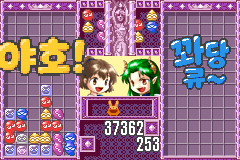

# 모두의 뿌요뿌요 (GBA)

[← 패치 목록으로 돌아가기](../README.md)

GBA **모두의 뿌요뿌요 (みんなでぷよぷよ / Minna de Puyo Puyo)** 한글 번역 패치입니다.

> ⚠️ **베타 배포 (v0.1.0)**: 번역·표기·그래픽과 패치 내용은 추후 변경될 수 있으며, 일부 조건에서 문제가 발생할 수 있습니다.

## 적용 방법

1. 아래 체크섬과 일치하는 일본판 원본 `Minna de Puyo Puyo (Japan) (En,Ja).gba`를 준비합니다. 다른 지역판이나 이전 한글판에는 적용하지 마세요.
2. [Minna de Puyo Puyo (GBA) KR v0.1.0.bps](https://raw.githubusercontent.com/mcpads/puyo-puyo-kr-patch/main/gba-minna-puyo/Minna%20de%20Puyo%20Puyo%20%28GBA%29%20KR%20v0.1.0.bps)를 다운로드합니다.
3. [Floating IPS (Flips)](https://github.com/Alcaro/Flips) 등 BPS 패처로 원본 GBA 파일에 적용합니다.
4. 게임의 언어 선택에서 한국어를 선택합니다. 영어 모드는 원문을 유지합니다.

## 체크섬

### 원본 일본판 GBA

| 항목 | 값 |
| --- | --- |
| 게임 코드 / 리비전 | APYJ / 0 |
| SHA-256 | `c6c5c6d73329d4af28d9a52ab0a000fdb6038c60969a0a0fce6b4a0ee3a7cc19` |
| 크기 | 8,388,608 bytes |

### 배포 패치 v0.1.0

| 항목 | 값 |
| --- | --- |
| SHA-256 | `e6e27bd5d6aec714a2118e1586c608c8cff65d350a66c910901670e39b125e5c` |
| 크기 | 2,019,376 bytes |

## 크레딧

- **패치 제작자**: mcpads
- **원작**: SEGA
