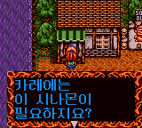
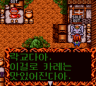
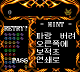

# 나조뿌요 - 아르르의 루 (게임기어)

[← 패치 목록으로 돌아가기](../README.md)

게임기어 **나조뿌요 - 아르르의 루 (なぞぷよ アルルのルー)** 한글 번역 패치입니다.

> **정식 배포 (v1.0.0)**

## 적용 방법

1. 아래 체크섬과 일치하는 일본판 원본 `Nazo Puyo - Arle no Roux (Japan).gg`를 준비합니다. 영문 패치판이나 이전 한글판에는 적용하지 마세요.
2. [Nazo Puyo - Arle no Roux (Game Gear) KR v1.0.0.bps](https://raw.githubusercontent.com/mcpads/puyo-puyo-kr-patch/main/gg-nazo-puyo/Nazo%20Puyo%20-%20Arle%20no%20Roux%20%28Game%20Gear%29%20KR%20v1.0.0.bps)를 다운로드합니다.
3. [Floating IPS (Flips)](https://github.com/Alcaro/Flips) 등 BPS 패처로 원본 ROM에 적용합니다.

## 패치 정보

- 대사·퍼즐 문구·힌트 및 게임 오버 제목 한글화
- 타이틀 로고와 퍼즐 결과 두루마리, 기존 영문 UI는 원문을 유지합니다.

## 체크섬

### 원본 일본판 ROM

| 항목 | 값 |
| --- | --- |
| SHA-256 | `61d0defafb2a747d6245e817c6ca58f3e66d86b3b3a6b98d376613bb6326449c` |
| CRC32 | `54AB42A4` |
| 크기 | 262,144 bytes |

### 배포 패치 v1.0.0

| 항목 | 값 |
| --- | --- |
| SHA-256 | `1635d5d66e80516fb4b5308d91249b40b12ec683e9dce98430d21c819330a1d4` |
| 크기 | 30,625 bytes |

## 크레딧

- **패치 제작자**: mcpads
- **원작**: Compile / SEGA
