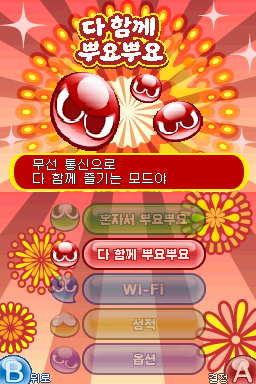
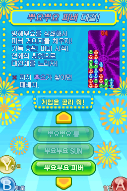
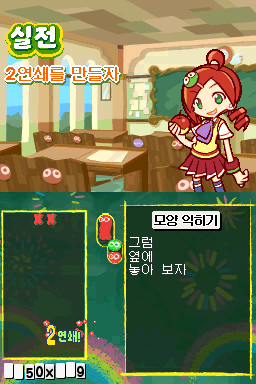
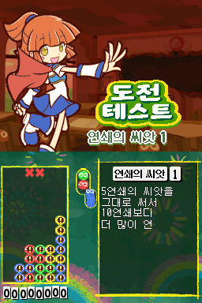
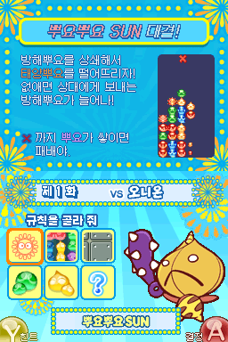

# 뿌요뿌요!! 20주년 기념판 (NDS)

[← 패치 목록으로 돌아가기](../README.md)

NDS **뿌요뿌요!! 20주년 기념판** 한글 번역 패치입니다.

> ⚠️ **베타 배포 (v0.2.0)**: 번역·표기·그래픽과 패치 내용은 추후 변경될 수 있으며, 일부 조건에서 문제가 발생할 수 있습니다.











## 적용 방법

1. 아래 체크섬과 일치하는 일본판 원본 NDS 파일을 준비합니다. 용량을 줄인 트림판이나 영어 패치판, 이전 한글판에는 적용하지 마세요.
2. [Puyo Puyo 20th Anniversary (NDS) KR v0.2.0.xdelta](https://raw.githubusercontent.com/mcpads/puyo-puyo-kr-patch/main/nds-puyo20/Puyo%20Puyo%2020th%20Anniversary%20%28NDS%29%20KR%20v0.2.0.xdelta)를 다운로드합니다.
3. `xdelta3` 등 xdelta 호환 패처로 원본 NDS 파일에 적용합니다.

```sh
xdelta3 -d -s "original-jp.nds" "Puyo Puyo 20th Anniversary (NDS) KR v0.2.0.xdelta" "Puyo Puyo 20th Anniversary (NDS) KR v0.2.0.nds"
```

## 참고 사항

- 다운로드 플레이로 전송되는 프로그램은 번역되지 않았습니다.
- 본체 메뉴에 표시되는 게임 이름은 영문 `Puyo Puyo!!`입니다.

## 체크섬

### 원본 일본판 NDS

| 항목 | 값 |
| --- | --- |
| 게임 코드 | TP4J |
| 리비전 | 0 |
| SHA-256 | `6b8227780eea751aa22b4201aea63c36d8844a994791109708d9fe2df399944d` |
| 크기 | 67,108,864 bytes (64 MiB) |

### 배포 패치 v0.2.0

| 항목 | 값 |
| --- | --- |
| SHA-256 | `4c5484a63f46e39ad30117d2f798bd86586d7a4e56b9eaa42b12a17c26378920` |
| 크기 | 1,897,908 bytes |

## 크레딧

- **패치 제작자**: mcpads
- **원작**: SEGA
