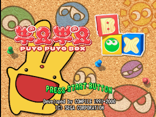
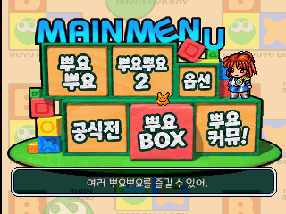
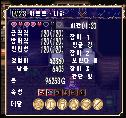

# 뿌요뿌요 BOX (PlayStation)

[← 패치 목록으로 돌아가기](../README.md)

PlayStation **뿌요뿌요 BOX (ぷよぷよBOX)** 한글 번역 패치입니다.

> ⚠️ **베타 배포 (v0.1.0)**: 번역·표기·그래픽과 패치 내용은 추후 변경될 수 있으며, 일부 조건에서 문제가 발생할 수 있습니다.







## 적용 방법

1. 아래 체크섬과 일치하는 일본판 원본 BIN/CUE를 준비합니다.
2. [Puyo Puyo BOX (PlayStation) KR v0.1.0.xdelta](https://raw.githubusercontent.com/mcpads/puyo-puyo-kr-patch/main/ps1-puyopuyo-box/Puyo%20Puyo%20BOX%20%28PlayStation%29%20KR%20v0.1.0.xdelta)를 다운로드합니다.
3. `xdelta3` 등 xdelta 호환 패처로 원본 BIN에 한글 패치를 적용합니다.
4. 원본 CUE를 복사한 뒤 `FILE` 행의 BIN 이름만 결과 BIN 이름으로 바꿉니다. `TRACK`과 `INDEX`는 유지합니다.

```sh
xdelta3 -d -s "Puyo Puyo Box (Japan).bin" "Puyo Puyo BOX (PlayStation) KR v0.1.0.xdelta" "Puyo Puyo BOX (PlayStation) KR v0.1.0.bin"
```

## 알려진 제한

- 통신 대전은 구현되어 있지 않습니다.

## 체크섬

### 배포 패치 v0.1.0

**Puyo Puyo BOX (PlayStation) KR v0.1.0.xdelta**

| 알고리즘 | 해시 |
| --- | --- |
| SHA-256 | `5218c44293d727500200c087147357db76924635a9c6f75c2087b5348a2012e2` |
| 크기 | 1,752,823 bytes |

### 원본 BIN (SLPS-03114, MODE2/2352)

| 알고리즘 | 해시 |
| --- | --- |
| SHA-1 | `ca01a98ccc5ca796df082782a6dd1adee856c064` |
| SHA-256 | `8403b1e2354107457063c5c1a8637a1ca706d6e6b19dd59c68885399256085fc` |
| 크기 | 141,853,824 bytes |

## 패치 정보

- 타이틀·메뉴와 퀘스트 모드 텍스트·UI 한글화
- 수록 뿌요뿌요 모드의 대사·메뉴·그래픽 한글화

## 크레딧

- **패치 제작자**: mcpads
- **리버싱**: mcpads (with Claude Code, Codex)
- **한글 번역**: Claude Code 및 Codex
- **QA**: mcpads
- **원작**: Compile (2000)
