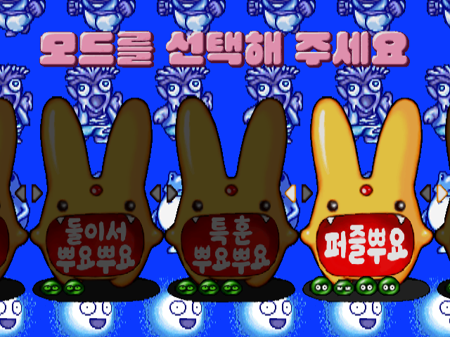
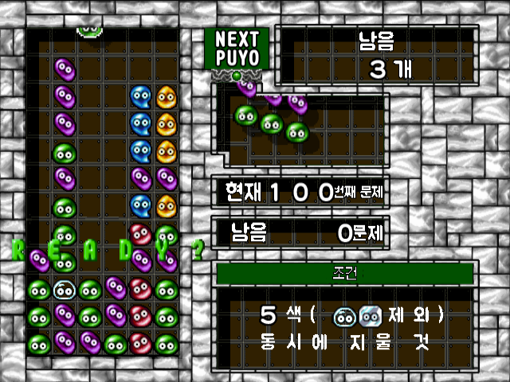

# 뿌요뿌요 2 퍼펙트 셋 (PlayStation 2)

[← 패치 목록으로 돌아가기](../README.md)

PlayStation 2 일본판 **SEGA AGES 2500 시리즈 Vol.12 뿌요뿌요 2 퍼펙트 셋** 한글 번역 패치입니다.

> ⚠️ **베타 배포 (v0.1.0)**: 번역·표기·그래픽과 패치 내용은 추후 변경될 수 있으며, 일부 화면과 기능은 추가 확인이 필요합니다.





## 적용 방법

1. 아래 체크섬과 일치하는 일본판 원본 BIN/CUE를 준비합니다.
2. [Puyo Puyo 2 Perfect Set (PlayStation 2) KR v0.1.0.xdelta](https://raw.githubusercontent.com/mcpads/puyo-puyo-kr-patch/main/ps2-puyopuyo2-perfect-set/Puyo%20Puyo%202%20Perfect%20Set%20%28PlayStation%202%29%20KR%20v0.1.0.xdelta)를 다운로드합니다.
3. `xdelta3` 등 xdelta 호환 패처로 원본 BIN에 한글 패치를 적용합니다.
4. 원본 CUE를 복사한 뒤 `FILE` 행의 BIN 이름만 결과 BIN 이름으로 바꿉니다. `TRACK`과 `INDEX`는 유지합니다.

```sh
xdelta3 -d -s "Sega Ages 2500 Series Vol. 12 - Puyo Puyo Tsuu - Perfect Set (Japan).bin" "Puyo Puyo 2 Perfect Set (PlayStation 2) KR v0.1.0.xdelta" "Puyo Puyo 2 Perfect Set (PlayStation 2) KR v0.1.0.bin"
```

## 알려진 제한

- 2인 대전은 아직 별도로 검증되지 않았습니다.
- 엔딩 음성 자막은 구현되어 있지 않습니다.
- SEGA AGES 오마케 카탈로그와 수록 영상은 한글화되지 않습니다.

## 체크섬

### 배포 패치 v0.1.0

**Puyo Puyo 2 Perfect Set (PlayStation 2) KR v0.1.0.xdelta**

| 알고리즘 | 해시 |
| --- | --- |
| SHA-256 | `5459583777a30ea13716e38e4b5ac3833dbed49d6271bc07b1435a68a51be996` |
| 크기 | 4,233,813 bytes |

### 원본 BIN (SLPM-62400, MODE2/2352)

| 알고리즘 | 해시 |
| --- | --- |
| SHA-256 | `93c8005f0a2ed83659307234b3298b3e8b3c0a78af3cd27a784fd26fc9d95ed4` |
| 크기 | 592,243,008 bytes |

### 원본 CUE

| 알고리즘 | 해시 |
| --- | --- |
| SHA-256 | `256731a1da3fdf8c5e1668cadbbea20257f22ecf3cc311115b3d324e564416f8` |
| 크기 | 134 bytes |

## 패치 정보

- 메뉴·스토리·퍼즐·전투 화면의 텍스트와 그래픽 한글화

## 크레딧

- **패치 제작자**: mcpads
- **리버싱**: mcpads (with Claude Code, Codex)
- **한글 번역**: Claude Code 및 Codex
- **QA**: mcpads
- **원작**: Sega / Compile (2003)
