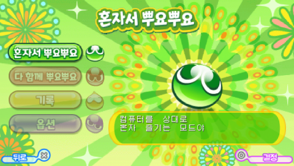
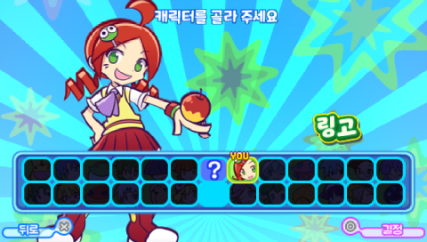
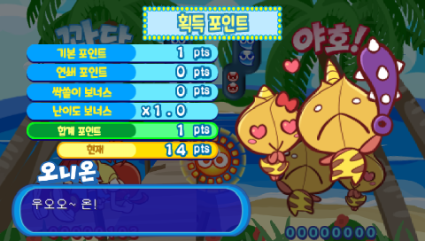
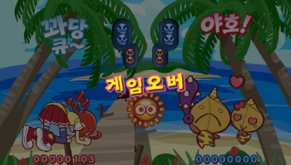

# 뿌요뿌요!! 20주년 기념판 (PSP)

[← 패치 목록으로 돌아가기](../README.md)

PSP **뿌요뿌요!! 20주년 기념판** 한글 번역 패치입니다.

> ⚠️ **베타 배포 (v0.1.0)**: 번역·표기·그래픽과 패치 내용은 추후 변경될 수 있으며, 일부 조건에서 문제가 발생할 수 있습니다.









## 적용 방법

1. 아래 체크섬과 일치하는 일본판 원본 ISO를 준비합니다. 영어 패치판이나 이전 한글판에는 적용하지 마세요.
2. [Puyo Puyo 20th Anniversary (PSP) KR v0.1.0.xdelta](https://raw.githubusercontent.com/mcpads/puyo-puyo-kr-patch/main/psp-puyo20/Puyo%20Puyo%2020th%20Anniversary%20%28PSP%29%20KR%20v0.1.0.xdelta)를 다운로드합니다.
3. `xdelta3` 등 xdelta 호환 패처로 원본 ISO에 적용합니다.

```sh
xdelta3 -d -s "original-jp.iso" "Puyo Puyo 20th Anniversary (PSP) KR v0.1.0.xdelta" "Puyo Puyo 20th Anniversary (PSP) KR v0.1.0.iso"
```

## 데이터 설치 주의사항

- 시작할 때 데이터 설치 안내에서는 반드시 **아니오**를 선택하세요. **예**를 선택하면 설치 화면에서 게임이 멈춥니다. 옵션의 데이터 설치도 실행하지 마세요.
- 기존 일본판 설치 데이터가 있으면 일본어 자산이 표시될 수 있습니다. 실행 전에 `PSP/SAVEDATA/NPJH50492DAT` 폴더를 삭제하세요.
- 게임 저장 데이터인 `PSP/SAVEDATA/NPJH50492`는 삭제하지 마세요. 설치 데이터와 다른 폴더입니다.

## 체크섬

### 원본 일본판 ISO

| 항목 | 값 |
| --- | --- |
| SHA-256 | `8f26636c1bc2b473bf1e54eec0ca798273b982481924520b3678bc899c0f0aa2` |
| 크기 | 1,353,154,560 bytes |

### 배포 패치 v0.1.0

| 항목 | 값 |
| --- | --- |
| SHA-256 | `929171e64786e0394d166aa32e4745be77a207942f7e4fa52521b2d56c3600d0` |
| 크기 | 8,556,858 bytes |

## 패치 정보

- 스토리·승리 대사, 메뉴·학교·상점과 그래픽 한글화

## 크레딧

- **패치 제작자**: mcpads
- **원작**: SEGA
