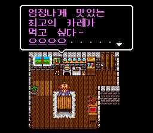
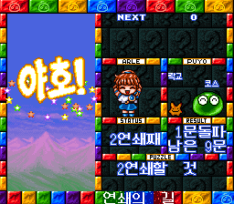
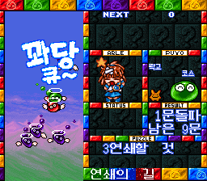

# 슈퍼 나조 뿌요 1 (SNES)

[← 패치 목록으로 돌아가기](../README.md)

SFC **슈퍼 퍼즐뿌요 1 (す～ぱ～なぞぷよ ルルーのルー, Super Nazo Puyo: Lulu no Lu)** 한글 번역 패치입니다.

참고: [슈퍼 퍼즐뿌요 - 나무위키](https://namu.wiki/w/%ED%8D%BC%EC%A6%90%EB%BF%8C%EC%9A%94%20%EC%8B%9C%EB%A6%AC%EC%A6%88#s-6)

## 적용 방법

1. **일본판 원본 ROM** (`Super Nazo Puyo - Lulu no Lu (Japan).sfc`, 헤더 없는 LoROM, 1MB)을 준비합니다.
2. [Super Nazo Puyo - Lulu no Lu (SNES) KR v1.0.0.bps](https://raw.githubusercontent.com/mcpads/puyo-puyo-kr-patch/main/sfc-nazo-puyo1/Super%20Nazo%20Puyo%20-%20Lulu%20no%20Lu%20%28SNES%29%20KR%20v1.0.0.bps)를 다운로드합니다.
3. [Floating IPS (Flips)](https://github.com/Alcaro/Flips) 등 BPS 패처로 원본 ROM에 적용합니다.

## 체크섬

### 배포 패치 v1.0.0

**Super Nazo Puyo - Lulu no Lu (SNES) KR v1.0.0.bps**

| 알고리즘 | 해시 |
| --- | --- |
| SHA-256 | `040c4b426bcc6b37638c5c981c7219157e310ce18b33779e30f6ae2a65c936eb` |
| 크기 | 183,470 bytes |

### 원본 ROM (SFC, 헤더 없음)

| 알고리즘 | 해시 |
| --- | --- |
| MD5 | `bf4658e6ab66ec4f5388e17d63b33157` |
| SHA-1 | `00b56744af9b5147ff38e72f12206ee0ea06ed67` |
| SHA-256 | `2c481008cffe2e0636762baf7e8a529a0246a3669be93bdce7efa8c13bdf7837` |
| 크기 | 1,048,576 bytes |

## 패치 정보

- 한글 폰트: neodgm, dalmoori
- [패처 코드베이스](https://github.com/mcpads/sfc-nazo-rulue1-kr-patcher)

## 크레딧

- **패치 제작자**: mcpads
- **리버싱**: mcpads (with Claude Code, Codex)
- **한글 번역**: Claude Code (Opus 4.8) 및 Codex
- **QA**: mcpads
- **원작**: Compile (1996)
