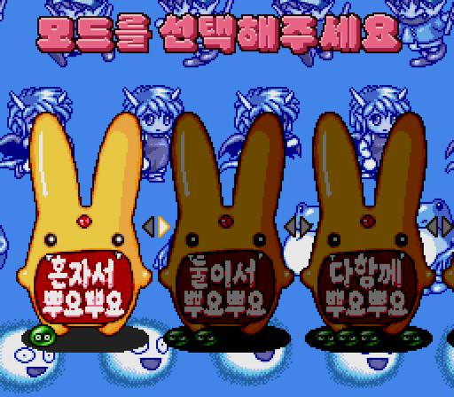
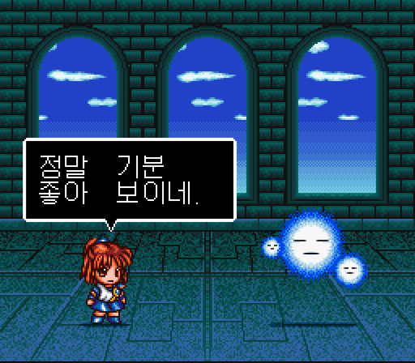
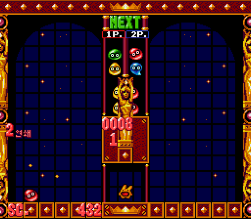

# 슈퍼 뿌요뿌요 2 리믹스 (SNES)

[← 패치 목록으로 돌아가기](../README.md)

SFC **슈퍼 뿌요뿌요 2 리믹스 (す〜ぱ〜ぷよぷよ通リミックス)** 한글 번역 패치입니다.

> ⚠️ **베타 배포 (v0.1.0)**: 번역·표기·그래픽과 패치 내용은 추후 변경될 수 있으며, 일부 조건에서 문제가 발생할 수 있습니다.

## 적용 방법

1. 아래 체크섬과 일치하는 **일본판 리믹스 원본 ROM** (`Super Puyo Puyo Tsuu Remix (Japan).sfc`, 헤더 없음, 2 MiB)을 준비합니다. 일반판 슈퍼 뿌요뿌요 2나 이전 한글판에는 적용하지 마세요.
2. [Super Puyo Puyo 2 Remix (SNES) KR v0.1.0.bps](https://raw.githubusercontent.com/mcpads/puyo-puyo-kr-patch/main/sfc-puyopuyo2-remix/Super%20Puyo%20Puyo%202%20Remix%20%28SNES%29%20KR%20v0.1.0.bps)를 다운로드합니다.
3. [Floating IPS (Flips)](https://github.com/Alcaro/Flips) 등 BPS 패처로 원본 ROM에 적용합니다.

## 참고 사항

- 메뉴 간판의 비선택 상태에서 글자 아래 가장자리가 붉은 줄처럼 보일 수 있습니다.

## 체크섬

### 원본 일본판 ROM (헤더 없음)

| 항목 | 값 |
| --- | --- |
| SHA-256 | `19f61feaa61c39254243a28d75ad921a39e4ad3de86c2888c7347691e9fb92fa` |
| 크기 | 2,097,152 bytes |

### 배포 패치 v0.1.0

| 항목 | 값 |
| --- | --- |
| SHA-256 | `9f9cdde83ef66b403154f82c9495712545b6f0c347345fb09a9b64253696631e` |
| 크기 | 141,678 bytes |

## 크레딧

- **패치 제작자**: mcpads
- **원작**: Compile
